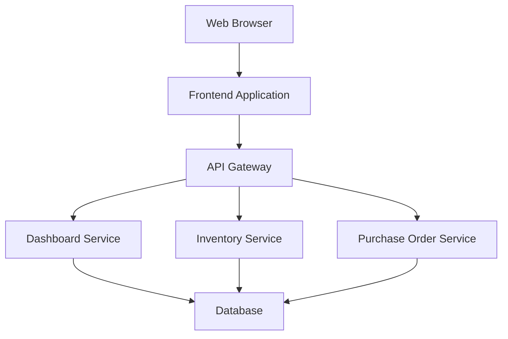

# Design Document

## Overview

The inventory dashboard is a web-based application that provides real-time visibility into inventory levels, purchase orders, and warehouse distribution. The system will be built using a modern web stack with a RESTful API backend and a responsive frontend interface.

## Architecture

The system follows a three-tier architecture:

1. **Presentation Layer**: Responsive web frontend with real-time updates
2. **Application Layer**: RESTful API with business logic and data aggregation
3. **Data Layer**: Relational database with optimized queries for dashboard performance



## Components and Interfaces

### Frontend Components

#### Global Warehouse Filter Component

- **Purpose**: Provide warehouse-scoped filtering for all dashboard data
- **Features**:
  - Dropdown selector with all warehouse locations
  - "All Warehouses" option for aggregated view
  - Real-time filtering of all dashboard components
  - Persistent filter state across page navigation
  - Clear visual indication of active filter

#### Summary Metrics Component

- **Purpose**: Display key inventory statistics in metric cards
- **Features**:
  - Five metric cards: Total Products, Low Stock, Out of Stock, Suppliers, Total Stock Value
  - Real-time data updates with warehouse filtering
  - Visual indicators for critical statuses
  - Currency formatting for stock value display
  - Responsive card layout
  - Click-through navigation to detailed views

#### Stock Levels Component

- **Purpose**: Display current inventory levels with product details
- **Features**:
  - Product image thumbnails with lazy loading
  - Sortable columns (SKU, Category, Quantity)
  - Search and filter functionality
  - Stock status filter (All, Low Stock, Out of Stock)
  - Low stock indicators
  - Responsive grid layout

#### Recent Purchases Component

- **Purpose**: Show latest purchase order activity
- **Features**:
  - Chronological order list (last 10 orders)
  - Status badges with color coding
  - Supplier quick links
  - Order detail expansion
  - Auto-refresh capability

#### Warehouse Distribution Component

- **Purpose**: Display inventory across multiple locations
- **Features**:
  - Location-based filtering
  - Quantity breakdown by warehouse
  - Transfer suggestions
  - Interactive warehouse map (future enhancement)

#### Stock Visualization Component

- **Purpose**: Provide visual representation of inventory distribution using bar/column charts
- **Features**:
  - Bar/column chart titled "Stock by Product per Warehouse"
  - Product names on x-axis, stock quantities on y-axis
  - Grouped bars for multi-warehouse comparison
  - Real-time updates with warehouse filter changes
  - Interactive tooltips with detailed information
  - Smooth animations for data transitions
  - Responsive design for all screen sizes
  - Brand-consistent styling and color scheme
  - Empty state handling for filtered views

#### Reorder Suggestions Component

- **Purpose**: Display proactive reorder recommendations based on current stock levels
- **Features**:
  - Dashboard section showing products approaching reorder points
  - Products with stock between 110% and 100% of reorder point
  - Urgency-based sorting (closest to reorder point first)
  - Current stock, reorder point, and estimated days until reorder needed
  - Click-through to purchase order creation modal
  - Empty state when all products have adequate stock
  - Warehouse filtering integration
  - Auto-refresh with configurable intervals

#### Enhanced Stock Filter Component

- **Purpose**: Provide advanced stock status filtering for improved product discoverability
- **Features**:
  - Dropdown filter with options: "All products", "Low stock", "Out of stock"
  - Real-time filtering without page refresh
  - Integration with existing warehouse and search filters
  - Clear visual indication of active filter state
  - Filter state persistence across navigation
  - Immediate table updates when filter selection changes
  - Combination with other filtering mechanisms

#### Inline Edit Component System

- **Purpose**: Enable quick product information updates directly within table rows
- **Features**:
  - In-place editing for Sale Price, Cost Price, Category, and Reorder Point fields
  - Click-to-edit interaction pattern with visual feedback
  - Per-row Save/Discard action buttons
  - Real-time validation with field-specific error messages
  - Atomic save operations for multiple field changes
  - Optimistic UI updates with rollback on failure
  - Concurrent edit conflict resolution
  - Auto-save with configurable delay option
  - Keyboard navigation support (Tab, Enter, Escape)
  - Touch-friendly controls for mobile devices

#### Real-time Update System

- **Purpose**: Ensure immediate database persistence and cross-component synchronization
- **Features**:
  - Immediate database writes on successful validation
  - Real-time dashboard metric recalculation
  - Cross-component data synchronization
  - WebSocket or Server-Sent Events for multi-user updates
  - Offline change queuing with retry mechanisms
  - Audit trail logging for all inline modifications
  - Conflict resolution for concurrent edits
  - Performance optimization for bulk updates

#### Purchase Order Creation Modal Component

- **Purpose**: Guided workflow for creating purchase orders from selected products
- **Features**:
  - Multi-step form: Order Details, Products, Review
  - Supplier selection filtered by product associations
  - Pre-populated product list from reorder action
  - Suggested quantity calculation: (reorder_point × 2) - current_stock
  - Editable quantity and unit price for each product
  - Order total calculation with tax and shipping
  - Form validation and error handling
  - Order summary and confirmation
  - Integration with existing purchase order system

#### Bulk Reorder Component

- **Purpose**: Enable bulk selection and reordering of multiple products
- **Features**:
  - Checkbox selection on stock levels and products tables
  - Select all/none functionality with count display
  - Bulk "Reorder Selected" button with selected count
  - Multi-product purchase order creation
  - Supplier grouping for products with different suppliers
  - Bulk quantity suggestions based on individual reorder points
  - Clear selection and cancel functionality

#### Products Management Component

- **Purpose**: Comprehensive product management interface with CRUD operations
- **Features**:
  - Product table with Image, Name, Category, Sale Price, Cost Price, Stock, Warehouse count columns
  - Sortable columns with pagination for large catalogs
  - Search and filter functionality (name, SKU, category, stock status)
  - Add Product button with form modal
  - View action opening detailed product modal
  - Delete action with confirmation dialog
  - Lazy loading for product images
  - Responsive table layout for mobile devices

#### Product Detail Modal Component

- **Purpose**: Display and edit detailed product information
- **Features**:
  - View mode showing product image, details, stock breakdown by warehouse
  - Edit mode with form fields for product modification
  - Supplier information display and management
  - Product variants display if applicable
  - Recent purchase history for the product
  - Stock level indicators (low stock, out of stock)
  - Image upload functionality
  - Form validation and error handling
  - Responsive modal design

#### Product Form Component

- **Purpose**: Handle comprehensive product creation and editing operations with per-warehouse stock management
- **Features**:
  - Required fields: name, SKU, category, cost price, sale price, reorder point
  - Optional fields: description, image URL
  - Per-warehouse stock level inputs with dynamic warehouse list
  - Real-time form validation with field-specific error messages
  - SKU uniqueness checking with immediate feedback
  - Image URL validation with preview functionality
  - Reorder point validation (must be positive number)
  - Warehouse stock quantity validation (non-negative numbers)
  - Form sections: Basic Info, Pricing, Stock Management, Image
  - Success and error message handling with detailed feedback
  - Form reset and cancel functionality with unsaved changes warning
  - Auto-save draft functionality for long forms
  - Responsive form layout for mobile devices

### Backend Services

#### Dashboard API Service

- **Endpoints**:
  - `GET /api/dashboard/summary-metrics?warehouse_id={id}` - Key inventory statistics with optional warehouse filtering
  - `GET /api/dashboard/stock-levels?warehouse_id={id}&stock_filter={status}` - Aggregated inventory data with filtering
  - `GET /api/dashboard/recent-purchases?warehouse_id={id}` - Latest purchase orders with optional warehouse filtering
  - `GET /api/dashboard/warehouse-distribution` - Location-based inventory
  - `GET /api/dashboard/stock-value?warehouse_id={id}` - Total stock value calculation
  - `GET /api/dashboard/stock-visualization?warehouse_id={id}` - Chart data for stock visualization by product and warehouse

#### Inventory Service

- **Endpoints**:
  - `GET /api/inventory/products` - Product catalog with variants
  - `GET /api/inventory/locations` - Warehouse locations
  - `GET /api/inventory/stock-levels/{locationId}` - Location-specific inventory

#### Purchase Order Service

- **Endpoints**:
  - `GET /api/purchase-orders` - Purchase order list with filtering
  - `GET /api/purchase-orders/{id}` - Detailed purchase order
  - `GET /api/suppliers` - Supplier information

#### Products Management Service

- **Endpoints**:
  - `GET /api/products` - Product list with filtering, sorting, and pagination
  - `GET /api/products/{id}` - Detailed product information with stock breakdown
  - `POST /api/products` - Create new product with per-warehouse stock levels
  - `PUT /api/products/{id}` - Update existing product
  - `DELETE /api/products/{id}` - Delete product with validation
  - `GET /api/products/categories` - Available product categories
  - `GET /api/products/{id}/suppliers` - Product supplier relationships
  - `POST /api/products/{id}/suppliers` - Add supplier to product
  - `DELETE /api/products/{id}/suppliers/{supplierId}` - Remove supplier from product
  - `GET /api/products/validate-sku/{sku}` - Validate SKU uniqueness
  - `GET /api/warehouses` - Available warehouse locations for stock setup

#### Stock Replenishment Service

- **Endpoints**:
  - `GET /api/replenishment/suggestions?warehouse_id={id}` - Reorder suggestions based on stock levels
  - `POST /api/replenishment/purchase-orders` - Create purchase order from selected products
  - `GET /api/replenishment/suppliers-for-products` - Get suppliers associated with specific products
  - `POST /api/replenishment/calculate-suggestions` - Calculate suggested quantities for products
  - `GET /api/replenishment/purchase-order-templates` - Get pre-filled purchase order templates

#### Enhanced Purchase Order Service

- **Endpoints**:
  - `GET /api/purchase-orders` - Purchase order list with filtering
  - `GET /api/purchase-orders/{id}` - Detailed purchase order
  - `POST /api/purchase-orders` - Create new purchase order
  - `PUT /api/purchase-orders/{id}` - Update purchase order status
  - `PUT /api/purchase-orders/{id}/receive` - Update received quantities
  - `GET /api/suppliers` - Supplier information
  - `GET /api/suppliers/by-products` - Suppliers filtered by product associations

#### Enhanced Stock Filtering Service

- **Endpoints**:
  - `GET /api/dashboard/stock-levels?stock_filter={all|low_stock|out_of_stock}` - Enhanced stock filtering with new filter options
  - `GET /api/products?stock_filter={all|low_stock|out_of_stock}` - Product filtering with stock status
  - `GET /api/dashboard/filter-options` - Available filter options and current counts

#### Inline Edit Service

- **Endpoints**:
  - `PATCH /api/products/{id}/inline` - Update specific product fields inline
  - `PUT /api/products/{id}/fields` - Bulk update multiple fields atomically
  - `POST /api/products/validate-inline` - Validate field values before saving
  - `GET /api/products/categories` - Available categories for dropdown
  - `POST /api/products/{id}/audit` - Log inline edit actions for audit trail

#### Real-time Synchronization Service

- **Endpoints**:
  - `GET /api/realtime/subscribe` - WebSocket endpoint for real-time updates
  - `POST /api/realtime/broadcast` - Broadcast changes to connected clients
  - `GET /api/dashboard/metrics/live` - Live dashboard metrics with change notifications

## Data Models

### Database Schema

Based on your requirements, the database schema includes:

#### Core Tables

**products**

```sql
- id (Primary Key)
- sku (Unique)
- name
- description
- category
- sale_price
- cost_price
- reorder_point
- image_url
- created_at
- updated_at
```

**product_variants**

```sql
- id (Primary Key)
- product_id (Foreign Key to products)
- variant_name
- variant_sku
- attributes (JSON)
- created_at
- updated_at
```

**locations** (warehouses)

```sql
- id (Primary Key)
- name
- address
- city
- state
- zip_code
- warehouse_type
- created_at
- updated_at
```

**product_locations** (inventory levels)

```sql
- id (Primary Key)
- product_id (Foreign Key to products)
- product_variant_id (Foreign Key to product_variants, nullable)
- location_id (Foreign Key to locations)
- quantity_on_hand
- quantity_reserved
- quantity_available (computed)
- unit_cost (for stock value calculations)
- reorder_point
- last_updated
```

**companies** (suppliers)

```sql
- id (Primary Key)
- name
- contact_name
- email
- phone
- address
- city
- state
- zip_code
- supplier_type
- created_at
- updated_at
```

**purchase_orders**

```sql
- id (Primary Key)
- po_number (Unique)
- supplier_id (Foreign Key to companies)
- order_date
- expected_delivery_date
- status (pending, confirmed, shipped, delivered, cancelled)
- total_amount
- notes
- created_at
- updated_at
```

**purchase_order_products**

```sql
- id (Primary Key)
- purchase_order_id (Foreign Key to purchase_orders)
- product_id (Foreign Key to products)
- product_variant_id (Foreign Key to product_variants, nullable)
- quantity_ordered
- unit_price
- total_price
- quantity_received
- created_at
- updated_at
```

### API Response Models

#### Summary Metrics Response

```json
{
  "metrics": {
    "total_products": {
      "value": 1250,
      "status": "normal"
    },
    "low_stock": {
      "value": 45,
      "status": "warning",
      "threshold": 50
    },
    "out_of_stock": {
      "value": 12,
      "status": "critical"
    },
    "suppliers": {
      "value": 28,
      "status": "normal"
    },
    "total_stock_value": {
      "value": 125000.5,
      "currency": "USD",
      "status": "normal",
      "excluded_products": 5
    }
  },
  "warehouse_filter": {
    "id": 1,
    "name": "Main Warehouse"
  },
  "last_updated": "2024-12-08T10:30:00Z"
}
```

#### Stock Level Response

```json
{
  "products": [
    {
      "id": 1,
      "sku": "ABC-123",
      "name": "Product Name",
      "category": "Electronics",
      "image_url": "/images/product.jpg",
      "total_quantity": 150,
      "unit_cost": 25.5,
      "total_value": 3825.0,
      "locations": [
        {
          "location_id": 1,
          "location_name": "Main Warehouse",
          "quantity": 100,
          "unit_cost": 25.5
        }
      ],
      "low_stock": false,
      "out_of_stock": false
    }
  ],
  "filters": {
    "warehouse_id": 1,
    "stock_filter": "all"
  },
  "pagination": {
    "page": 1,
    "limit": 50,
    "total": 1250
  }
}
```

#### Recent Purchases Response

```json
{
  "recent_orders": [
    {
      "id": 1,
      "po_number": "PO-2024-001",
      "supplier": {
        "id": 1,
        "name": "Supplier Corp"
      },
      "order_date": "2024-12-01",
      "status": "delivered",
      "product_count": 5,
      "total_amount": 1500.0
    }
  ]
}
```

#### Stock Visualization Response

```json
{
  "chart_data": {
    "products": [
      {
        "product_id": 1,
        "product_name": "Product A",
        "sku": "ABC-123",
        "warehouses": [
          {
            "warehouse_id": 1,
            "warehouse_name": "Main Warehouse",
            "quantity": 150,
            "color": "#3B82F6"
          },
          {
            "warehouse_id": 2,
            "warehouse_name": "Secondary Warehouse",
            "quantity": 75,
            "color": "#10B981"
          }
        ]
      }
    ],
    "chart_config": {
      "title": "Stock by Product per Warehouse",
      "x_axis_label": "Products",
      "y_axis_label": "Stock Quantity",
      "color_palette": ["#3B82F6", "#10B981", "#F59E0B", "#EF4444", "#8B5CF6"]
    }
  },
  "filters": {
    "warehouse_id": null,
    "warehouse_name": "All Warehouses"
  },
  "last_updated": "2024-12-08T10:30:00Z"
}
```

#### Product Creation Request/Response

**Create Product Request**

```json
{
  "name": "New Product Name",
  "sku": "NP-001",
  "description": "Product description",
  "category": "Electronics",
  "cost_price": 25.5,
  "sale_price": 45.99,
  "reorder_point": 50,
  "image_url": "https://example.com/image.jpg",
  "warehouse_stock": [
    {
      "warehouse_id": 1,
      "initial_quantity": 100
    },
    {
      "warehouse_id": 2,
      "initial_quantity": 50
    }
  ]
}
```

**Create Product Response**

```json
{
  "product": {
    "id": 123,
    "name": "New Product Name",
    "sku": "NP-001",
    "description": "Product description",
    "category": "Electronics",
    "cost_price": 25.5,
    "sale_price": 45.99,
    "reorder_point": 50,
    "image_url": "https://example.com/image.jpg",
    "created_at": "2024-12-08T10:30:00Z",
    "stock_levels": [
      {
        "warehouse_id": 1,
        "warehouse_name": "Main Warehouse",
        "quantity": 100,
        "unit_cost": 25.5
      },
      {
        "warehouse_id": 2,
        "warehouse_name": "Secondary Warehouse",
        "quantity": 50,
        "unit_cost": 25.5
      }
    ],
    "total_stock": 150,
    "stock_status": "adequate"
  },
  "message": "Product created successfully"
}
```

#### Warehouse List Response

```json
{
  "warehouses": [
    {
      "id": 1,
      "name": "Main Warehouse",
      "address": "123 Main St, City, State 12345",
      "active": true
    },
    {
      "id": 2,
      "name": "Secondary Warehouse",
      "address": "456 Oak Ave, City, State 12345",
      "active": true
    }
  ]
}
```

#### Reorder Suggestions Response

```json
{
  "suggestions": [
    {
      "product_id": 1,
      "sku": "ABC-123",
      "name": "Product Name",
      "category": "Electronics",
      "current_stock": 55,
      "reorder_point": 50,
      "suggested_quantity": 95,
      "urgency_score": 0.9,
      "days_until_reorder": 3,
      "primary_supplier": {
        "id": 1,
        "name": "Supplier Corp",
        "last_order_date": "2024-11-15"
      },
      "stock_trend": "declining",
      "average_daily_usage": 2.5
    }
  ],
  "total_suggestions": 12,
  "warehouse_filter": {
    "id": 1,
    "name": "Main Warehouse"
  },
  "last_updated": "2024-12-08T10:30:00Z"
}
```

#### Purchase Order Creation Request

```json
{
  "supplier_id": 1,
  "expected_delivery_date": "2024-12-20",
  "notes": "Urgent reorder for low stock items",
  "products": [
    {
      "product_id": 1,
      "quantity": 100,
      "unit_price": 25.5
    },
    {
      "product_id": 2,
      "quantity": 50,
      "unit_price": 15.75
    }
  ],
  "warehouse_id": 1
}
```

#### Purchase Order Creation Response

```json
{
  "purchase_order": {
    "id": 123,
    "po_number": "PO-2024-123",
    "supplier": {
      "id": 1,
      "name": "Supplier Corp",
      "contact_name": "John Smith",
      "email": "john@supplier.com"
    },
    "order_date": "2024-12-08",
    "expected_delivery_date": "2024-12-20",
    "status": "pending",
    "total_amount": 3337.5,
    "products": [
      {
        "product_id": 1,
        "sku": "ABC-123",
        "name": "Product Name",
        "quantity": 100,
        "unit_price": 25.5,
        "total_price": 2550.0
      },
      {
        "product_id": 2,
        "sku": "DEF-456",
        "name": "Another Product",
        "quantity": 50,
        "unit_price": 15.75,
        "total_price": 787.5
      }
    ],
    "created_at": "2024-12-08T10:30:00Z"
  },
  "message": "Purchase order created successfully"
}
```

#### Suppliers for Products Response

```json
{
  "suppliers": [
    {
      "id": 1,
      "name": "Supplier Corp",
      "contact_name": "John Smith",
      "email": "john@supplier.com",
      "phone": "+1-555-0123",
      "products": [1, 2, 5],
      "last_order_date": "2024-11-15",
      "average_delivery_days": 7,
      "reliability_score": 0.95
    },
    {
      "id": 2,
      "name": "Another Supplier",
      "contact_name": "Jane Doe",
      "email": "jane@anothersupplier.com",
      "phone": "+1-555-0456",
      "products": [3, 4],
      "last_order_date": "2024-10-20",
      "average_delivery_days": 10,
      "reliability_score": 0.88
    }
  ],
  "product_ids": [1, 2, 3, 4, 5]
}
```

#### Enhanced Stock Filter Response

```json
{
  "products": [
    {
      "id": 1,
      "sku": "ABC-123",
      "name": "Product Name",
      "category": "Electronics",
      "sale_price": 45.99,
      "cost_price": 25.5,
      "reorder_point": 50,
      "total_quantity": 25,
      "stock_status": "low_stock",
      "editable_fields": {
        "sale_price": true,
        "cost_price": true,
        "category": true,
        "reorder_point": true
      }
    }
  ],
  "filters": {
    "stock_filter": "low_stock",
    "warehouse_id": null
  },
  "filter_counts": {
    "all": 1250,
    "low_stock": 45,
    "out_of_stock": 12
  }
}
```

#### Inline Edit Request/Response

**Inline Edit Request**

```json
{
  "field": "sale_price",
  "value": 49.99,
  "product_id": 123
}
```

**Inline Edit Response**

```json
{
  "success": true,
  "product": {
    "id": 123,
    "field": "sale_price",
    "old_value": 45.99,
    "new_value": 49.99,
    "updated_at": "2024-12-08T10:30:00Z"
  },
  "affected_metrics": {
    "total_stock_value": 125500.75,
    "stock_status_changed": false
  },
  "message": "Sale price updated successfully"
}
```

**Bulk Field Update Request**

```json
{
  "product_id": 123,
  "fields": {
    "sale_price": 49.99,
    "cost_price": 27.0,
    "category": "Premium Electronics",
    "reorder_point": 75
  }
}
```

**Bulk Field Update Response**

```json
{
  "success": true,
  "product": {
    "id": 123,
    "updated_fields": {
      "sale_price": {
        "old_value": 45.99,
        "new_value": 49.99
      },
      "cost_price": {
        "old_value": 25.5,
        "new_value": 27.0
      },
      "category": {
        "old_value": "Electronics",
        "new_value": "Premium Electronics"
      },
      "reorder_point": {
        "old_value": 50,
        "new_value": 75
      }
    },
    "updated_at": "2024-12-08T10:30:00Z"
  },
  "affected_metrics": {
    "total_stock_value": 125750.25,
    "stock_status_changed": true,
    "new_stock_status": "adequate"
  },
  "message": "Product updated successfully"
}
```

#### Real-time Update Notification

```json
{
  "type": "product_updated",
  "product_id": 123,
  "changes": {
    "sale_price": {
      "old_value": 45.99,
      "new_value": 49.99
    }
  },
  "affected_components": [
    "summary_metrics",
    "stock_levels",
    "stock_visualization"
  ],
  "updated_metrics": {
    "total_stock_value": 125500.75
  },
  "timestamp": "2024-12-08T10:30:00Z",
  "user_id": 456
}
```

## Stock Replenishment Workflow

### Reorder Trigger Points

The system provides multiple entry points for initiating stock replenishment:

1. **Individual Product Reorder**:

   - "Reorder Stock" button on each product row in stock levels table
   - "Reorder Stock" button on each product row in products management page
   - Click-through from reorder suggestions component

2. **Bulk Product Reorder**:

   - Checkbox selection on stock levels table
   - Checkbox selection on products management page
   - "Reorder Selected" button for multiple products

3. **Proactive Suggestions**:
   - Reorder suggestions component on dashboard
   - Automated suggestions based on stock levels and usage trends

### Purchase Order Creation Modal Design

The purchase order creation modal follows a three-step wizard approach:

#### Step 1: Order Details

1. **Supplier Selection**:

   - Dropdown filtered to suppliers associated with selected products
   - If no supplier association exists, show all available suppliers
   - Display supplier contact information and reliability metrics
   - Show last order date and average delivery time

2. **Delivery Information**:

   - Expected delivery date picker with supplier average delivery time pre-filled
   - Warehouse destination selection (defaults to primary warehouse)
   - Order priority selection (Normal, Urgent, Critical)

3. **Order Notes**:
   - Free text field for special instructions
   - Pre-populated templates for common scenarios (reorder, emergency, etc.)

#### Step 2: Products Review

1. **Product List Display**:

   - Table showing selected products with current stock levels
   - Reorder point display for context
   - Suggested quantity calculation: (reorder_point × 2) - current_stock
   - Editable quantity and unit price fields

2. **Quantity Suggestions**:

   - Smart suggestions based on reorder points and usage trends
   - Visual indicators for suggested vs. custom quantities
   - Bulk quantity adjustment options (increase all by %, set minimum order quantities)

3. **Pricing Information**:
   - Last purchase price display for reference
   - Unit price editing with validation
   - Real-time total calculation per product and order total

#### Step 3: Review and Confirmation

1. **Order Summary**:

   - Complete order details with supplier information
   - Product breakdown with quantities and pricing
   - Total cost calculation including any applicable taxes or fees
   - Estimated delivery date and warehouse destination

2. **Validation and Submission**:
   - Final validation of all required fields
   - Confirmation of order details
   - Submit button with loading state during creation
   - Success confirmation with order number

### Bulk Reorder Handling

When multiple products are selected for reordering:

1. **Supplier Grouping**:

   - Automatically group products by their primary suppliers
   - Create separate purchase orders for each supplier
   - Display supplier grouping in the modal for user confirmation

2. **Mixed Supplier Scenarios**:

   - Allow user to reassign products to different suppliers if needed
   - Show warning when products don't have associated suppliers
   - Provide option to split orders or assign all to one supplier

3. **Quantity Management**:
   - Apply bulk quantity adjustments across all selected products
   - Maintain individual product suggestions while allowing bulk modifications
   - Validate minimum order quantities per supplier

## Product Creation Workflow

### Form Design and User Experience

The product creation modal follows a structured approach to collect comprehensive product information:

#### Form Layout

1. **Modal Structure**:

   - Large modal (800px width) with scrollable content
   - Header with "Add New Product" title and close button
   - Form sections with clear visual separation
   - Footer with Cancel and Save buttons

2. **Form Sections**:

   - **Basic Information**: Name, SKU, Category, Description
   - **Pricing**: Cost Price, Sale Price
   - **Inventory Management**: Reorder Point, Per-warehouse stock levels
   - **Media**: Image URL with preview

3. **Warehouse Stock Section**:
   - Dynamic list of all active warehouses
   - Each warehouse shows: Name, Address, Quantity input field
   - Default quantity of 0 for all warehouses
   - Visual indicators for required vs optional stock setup

#### Validation Rules

1. **Required Field Validation**:

   - Name: 1-255 characters, no special characters except hyphens and spaces
   - SKU: 3-50 characters, alphanumeric with hyphens, must be unique
   - Category: Must be selected from predefined list
   - Cost Price: Positive decimal number, max 2 decimal places
   - Sale Price: Positive decimal number, max 2 decimal places, must be >= cost price
   - Reorder Point: Non-negative integer

2. **Optional Field Validation**:

   - Description: Max 1000 characters
   - Image URL: Valid URL format, optional preview validation
   - Warehouse Stock: Non-negative integers, defaults to 0

3. **Business Logic Validation**:
   - SKU uniqueness check via API call
   - Sale price must be greater than or equal to cost price
   - At least one warehouse must have stock > 0 (warning, not error)
   - Image URL accessibility check (optional)

#### Form Behavior

1. **Real-time Validation**:

   - Field validation on blur and form submission
   - SKU uniqueness check with 500ms debounce
   - Visual feedback with error messages below fields
   - Form submission disabled until all required fields are valid

2. **User Experience Features**:

   - Auto-focus on first field when modal opens
   - Tab navigation through all form fields
   - Escape key to close modal (with unsaved changes warning)
   - Loading states during SKU validation and form submission
   - Success message and automatic modal close on successful creation

3. **Error Handling**:
   - Field-level error messages with specific guidance
   - Form-level error summary for submission failures
   - Network error handling with retry options
   - Validation error persistence until resolved

### Backend Processing

1. **Product Creation Transaction**:

   - Create product record with basic information
   - Create inventory records for each warehouse with stock > 0
   - Calculate initial stock status based on reorder point
   - Update dashboard metrics and caches
   - Return complete product data with stock breakdown

2. **Data Integrity**:
   - Database transaction ensures all-or-nothing creation
   - SKU uniqueness enforced at database level
   - Audit trail for product creation events
   - Rollback mechanism for failed creations

## Error Handling

### Frontend Error Handling

- **Network Errors**: Display retry mechanisms with exponential backoff
- **Data Loading**: Show skeleton loaders during API calls
- **Empty States**: Provide helpful messages when no data is available
- **Validation Errors**: Display inline validation messages

### Backend Error Handling

- **Database Connectivity**: Implement connection pooling and retry logic
- **API Rate Limiting**: Return appropriate HTTP status codes (429)
- **Data Validation**: Validate all input parameters and return structured error responses
- **Logging**: Comprehensive logging for debugging and monitoring

### Error Response Format

```json
{
  "error": {
    "code": "INVENTORY_NOT_FOUND",
    "message": "No inventory data found for the specified criteria",
    "details": {
      "location_id": 123,
      "timestamp": "2024-12-08T10:30:00Z"
    }
  }
}
```

## Testing Strategy

### Unit Testing

- **Frontend**: Component testing with Jest and React Testing Library
- **Backend**: Service layer testing with mocked database interactions
- **Database**: Repository pattern testing with test database

### Integration Testing

- **API Testing**: End-to-end API testing with real database
- **Database Testing**: Schema validation and query performance testing
- **Cross-browser Testing**: Ensure compatibility across major browsers

### Performance Testing

- **Load Testing**: Simulate concurrent users accessing dashboard
- **Database Performance**: Query optimization and indexing validation
- **Frontend Performance**: Bundle size optimization and lazy loading validation

### Test Data Strategy

- **Seed Data**: Create realistic test datasets for development
- **Mock Data**: Generate mock responses for frontend development
- **Performance Data**: Large datasets for performance testing

## Security Considerations

### Authentication & Authorization

- **User Authentication**: JWT-based authentication
- **Role-based Access**: Different access levels for warehouse vs procurement teams
- **API Security**: Rate limiting and input validation

### Data Protection

- **SQL Injection Prevention**: Parameterized queries and ORM usage
- **XSS Protection**: Input sanitization and CSP headers
- **HTTPS**: All communications over encrypted connections

## Performance Optimizations

### Database Optimizations

- **Indexing**: Strategic indexes on frequently queried columns
- **Query Optimization**: Efficient joins and aggregations
- **Caching**: Redis caching for frequently accessed data

### Frontend Optimizations

- **Code Splitting**: Lazy load components and routes
- **Image Optimization**: Compressed images with multiple sizes
- **Virtual Scrolling**: Handle large product lists efficiently

### API Optimizations

- **Response Compression**: Gzip compression for API responses
- **Pagination**: Limit result sets with cursor-based pagination
- **Field Selection**: Allow clients to specify required fields
