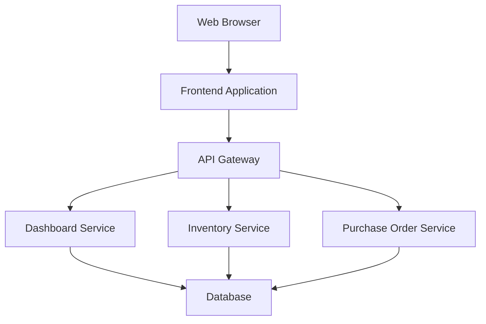

# Design Document

## Overview

The inventory dashboard is a web-based application that provides real-time visibility into inventory levels, purchase orders, and warehouse distribution. The system will be built using a modern web stack with a RESTful API backend and a responsive frontend interface.

## Architecture

The system follows a three-tier architecture:

1. **Presentation Layer**: Responsive web frontend with real-time updates
2. **Application Layer**: RESTful API with business logic and data aggregation
3. **Data Layer**: Relational database with optimized queries for dashboard performance



## Components and Interfaces

### Frontend Components

#### Summary Metrics Component

- **Purpose**: Display key inventory statistics in metric cards
- **Features**:
  - Four metric cards: Total Products, Low Stock, Out of Stock, Suppliers
  - Real-time data updates
  - Visual indicators for critical statuses
  - Responsive card layout
  - Click-through navigation to detailed views

#### Stock Levels Component

- **Purpose**: Display current inventory levels with product details
- **Features**:
  - Product image thumbnails with lazy loading
  - Sortable columns (SKU, Category, Quantity)
  - Search and filter functionality
  - Low stock indicators
  - Responsive grid layout

#### Recent Purchases Component

- **Purpose**: Show latest purchase order activity
- **Features**:
  - Chronological order list (last 10 orders)
  - Status badges with color coding
  - Supplier quick links
  - Order detail expansion
  - Auto-refresh capability

#### Warehouse Distribution Component

- **Purpose**: Display inventory across multiple locations
- **Features**:
  - Location-based filtering
  - Quantity breakdown by warehouse
  - Transfer suggestions
  - Interactive warehouse map (future enhancement)

### Backend Services

#### Dashboard API Service

- **Endpoints**:
  - `GET /api/dashboard/summary-metrics` - Key inventory statistics
  - `GET /api/dashboard/stock-levels` - Aggregated inventory data
  - `GET /api/dashboard/recent-purchases` - Latest purchase orders
  - `GET /api/dashboard/warehouse-distribution` - Location-based inventory

#### Inventory Service

- **Endpoints**:
  - `GET /api/inventory/products` - Product catalog with variants
  - `GET /api/inventory/locations` - Warehouse locations
  - `GET /api/inventory/stock-levels/{locationId}` - Location-specific inventory

#### Purchase Order Service

- **Endpoints**:
  - `GET /api/purchase-orders` - Purchase order list with filtering
  - `GET /api/purchase-orders/{id}` - Detailed purchase order
  - `GET /api/suppliers` - Supplier information

## Data Models

### Database Schema

Based on your requirements, the database schema includes:

#### Core Tables

**products**

```sql
- id (Primary Key)
- sku (Unique)
- name
- description
- category
- image_url
- created_at
- updated_at
```

**product_variants**

```sql
- id (Primary Key)
- product_id (Foreign Key to products)
- variant_name
- variant_sku
- attributes (JSON)
- created_at
- updated_at
```

**locations** (warehouses)

```sql
- id (Primary Key)
- name
- address
- city
- state
- zip_code
- warehouse_type
- created_at
- updated_at
```

**product_locations** (inventory levels)

```sql
- id (Primary Key)
- product_id (Foreign Key to products)
- product_variant_id (Foreign Key to product_variants, nullable)
- location_id (Foreign Key to locations)
- quantity_on_hand
- quantity_reserved
- quantity_available (computed)
- reorder_point
- last_updated
```

**companies** (suppliers)

```sql
- id (Primary Key)
- name
- contact_name
- email
- phone
- address
- city
- state
- zip_code
- supplier_type
- created_at
- updated_at
```

**purchase_orders**

```sql
- id (Primary Key)
- po_number (Unique)
- supplier_id (Foreign Key to companies)
- order_date
- expected_delivery_date
- status (pending, confirmed, shipped, delivered, cancelled)
- total_amount
- notes
- created_at
- updated_at
```

**purchase_order_products**

```sql
- id (Primary Key)
- purchase_order_id (Foreign Key to purchase_orders)
- product_id (Foreign Key to products)
- product_variant_id (Foreign Key to product_variants, nullable)
- quantity_ordered
- unit_price
- total_price
- quantity_received
- created_at
- updated_at
```

### API Response Models

#### Summary Metrics Response

```json
{
  "metrics": {
    "total_products": {
      "value": 1250,
      "status": "normal"
    },
    "low_stock": {
      "value": 45,
      "status": "warning",
      "threshold": 50
    },
    "out_of_stock": {
      "value": 12,
      "status": "critical"
    },
    "suppliers": {
      "value": 28,
      "status": "normal"
    }
  },
  "last_updated": "2024-12-08T10:30:00Z"
}
```

#### Stock Level Response

```json
{
  "products": [
    {
      "id": 1,
      "sku": "ABC-123",
      "name": "Product Name",
      "category": "Electronics",
      "image_url": "/images/product.jpg",
      "total_quantity": 150,
      "locations": [
        {
          "location_id": 1,
          "location_name": "Main Warehouse",
          "quantity": 100
        }
      ],
      "low_stock": false
    }
  ]
}
```

#### Recent Purchases Response

```json
{
  "recent_orders": [
    {
      "id": 1,
      "po_number": "PO-2024-001",
      "supplier": {
        "id": 1,
        "name": "Supplier Corp"
      },
      "order_date": "2024-12-01",
      "status": "delivered",
      "product_count": 5,
      "total_amount": 1500.0
    }
  ]
}
```

## Error Handling

### Frontend Error Handling

- **Network Errors**: Display retry mechanisms with exponential backoff
- **Data Loading**: Show skeleton loaders during API calls
- **Empty States**: Provide helpful messages when no data is available
- **Validation Errors**: Display inline validation messages

### Backend Error Handling

- **Database Connectivity**: Implement connection pooling and retry logic
- **API Rate Limiting**: Return appropriate HTTP status codes (429)
- **Data Validation**: Validate all input parameters and return structured error responses
- **Logging**: Comprehensive logging for debugging and monitoring

### Error Response Format

```json
{
  "error": {
    "code": "INVENTORY_NOT_FOUND",
    "message": "No inventory data found for the specified criteria",
    "details": {
      "location_id": 123,
      "timestamp": "2024-12-08T10:30:00Z"
    }
  }
}
```

## Testing Strategy

### Unit Testing

- **Frontend**: Component testing with Jest and React Testing Library
- **Backend**: Service layer testing with mocked database interactions
- **Database**: Repository pattern testing with test database

### Integration Testing

- **API Testing**: End-to-end API testing with real database
- **Database Testing**: Schema validation and query performance testing
- **Cross-browser Testing**: Ensure compatibility across major browsers

### Performance Testing

- **Load Testing**: Simulate concurrent users accessing dashboard
- **Database Performance**: Query optimization and indexing validation
- **Frontend Performance**: Bundle size optimization and lazy loading validation

### Test Data Strategy

- **Seed Data**: Create realistic test datasets for development
- **Mock Data**: Generate mock responses for frontend development
- **Performance Data**: Large datasets for performance testing

## Security Considerations

### Authentication & Authorization

- **User Authentication**: JWT-based authentication
- **Role-based Access**: Different access levels for warehouse vs procurement teams
- **API Security**: Rate limiting and input validation

### Data Protection

- **SQL Injection Prevention**: Parameterized queries and ORM usage
- **XSS Protection**: Input sanitization and CSP headers
- **HTTPS**: All communications over encrypted connections

## Performance Optimizations

### Database Optimizations

- **Indexing**: Strategic indexes on frequently queried columns
- **Query Optimization**: Efficient joins and aggregations
- **Caching**: Redis caching for frequently accessed data

### Frontend Optimizations

- **Code Splitting**: Lazy load components and routes
- **Image Optimization**: Compressed images with multiple sizes
- **Virtual Scrolling**: Handle large product lists efficiently

### API Optimizations

- **Response Compression**: Gzip compression for API responses
- **Pagination**: Limit result sets with cursor-based pagination
- **Field Selection**: Allow clients to specify required fields
